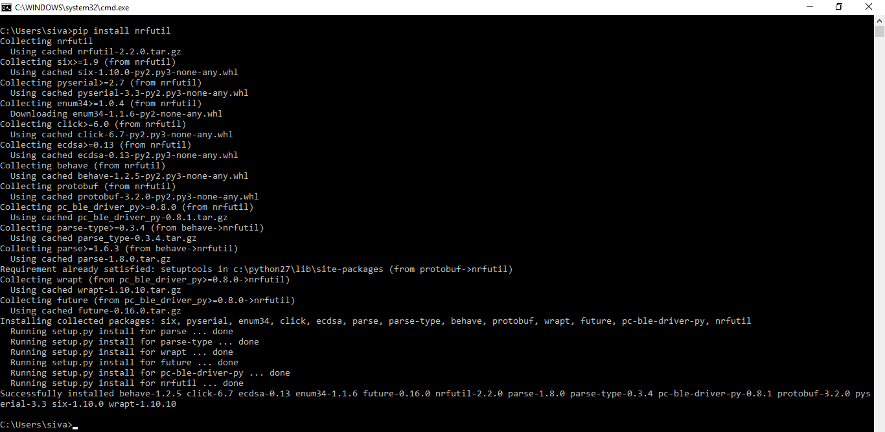
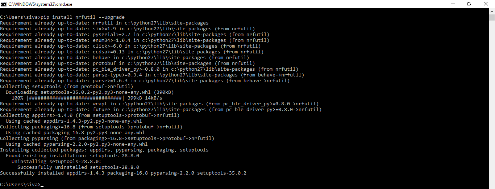
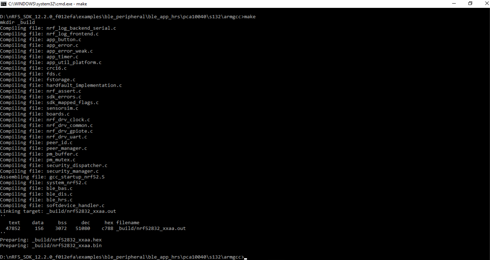
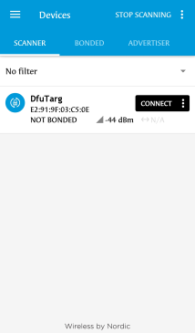
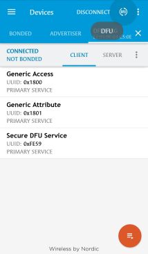
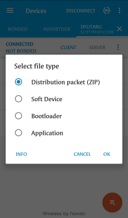
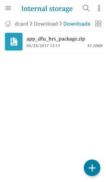
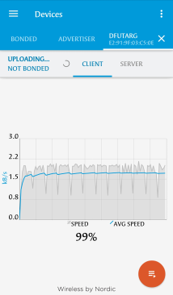
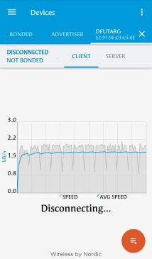
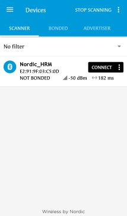

## Uploading code using DFU OTA

DFU stands for "Device Firmware Update" and OTA stands for "Over The Air". Bluey
comes with a bootloader which allows you to upload code over BLE.

Nordic now mandates using a secure bootloader which uses a private key to upload
firmware. In a real scenario, you would need to create and install a bootloader
in your nRF52 device that uses a private key known to you only, so that only you
can update your device. But since we are supplying you with a bootloader, we have
made this private key available to everyone. Please do not use this bootloader
in any device where you consider security to be a priority - create your own by
[following instructions][1] from Nordic Semiconductor.

Here are the steps involved in uploading your code using DFU OTA and our private key.

* Download latest release of [Python 2](https://www.python.org/downloads/)

* Install Python

* Add python to environment variables. **python.exe** can be found in `<Python2x_Install_Direc>`

* Add pip to environment variables. **pip.exe** and **pip2.exe** can be found in `<Python2x_Install_Direc>\Scripts`

* Run: `pip install nrfutil` or `pip2 install nrfutil`

* Check for updates: `pip install nrfutil --upgrade` or `pip2 install nrfutil --upgrade`

* **nrfutil.exe** can be found in `<Python2x_Install_Directory>\Scripts`. So, it is automatically included in environment variables.

* Run: `nrfutil --help` to check whether the package is installed properly.

* Using Windows Explorer, open: `nRF5_SDK_12.2.0_f012efa\examples\ble_peripheral\ble_app_hrs\pca10040\s132\armgcc`.

* In command prompt, run: `cd nRF5_SDK_12.2.0_f012efa\examples\ble_peripheral\ble_app_hrs\pca10040\s132\armgcc`

* Run: `make`, to generate hex file.

* Copy ***private.key*** file provided in the top level of this repository into the SDK
example *_build* directory. This will be similar to:  *nRF5_SDK_12.2.0_f012efa\examples\ble_peripheral\ble_app_hrs\pca10040\s132\armgcc\_build*

* In command prompt, `cd _build` to access the directory where hex file is stored.

* Run: `nrfutil pkg generate --hw-version 52 --application-version 1 --application nrf52832_xxaa.hex --sd-req 0x8C --key-file private.key app_dfu_hrs_package.zip`

*Note:* Use *--sd-req = 0x8C* for s132_nrf52_3.0.0 and *--sd-req = 0x98* for s132_nrf52_4.0.2.
Find complete list [here](https://github.com/NordicSemiconductor/pc-nrfutil)

* Once the zip package has been created, transfer the file to your mobile or save it to Google Drive. The file should be accessible from the smartphone.

* Connect **bluey** to the PC.

* Enter bootloader mode: Press SW3 switch followed by RST switch. Release RST switch. Once LED is red, release SW3 switch.

* Scan for bluey using nRF Connect or nRF Toolbox. The device should advertise as ***DfuTarg***

* Connect: ***DfuTarg***

* Press the **DFU** symbol.

* Select Distribution packet (ZIP) option.

* Select the package that was transferred to the smartphone earlier.

* Wait for the update to reach 100%.

* Wait for the device to disconnect.

* The device resets once the upload is complete and should advertise as ***Nordic_HRM***

Congratulations! You have successfully uploaded code to Bluey via DFU OTA.

[1]: https://devzone.nordicsemi.com/blogs/1085/getting-started-with-nordics-secure-dfu-bootloader/
